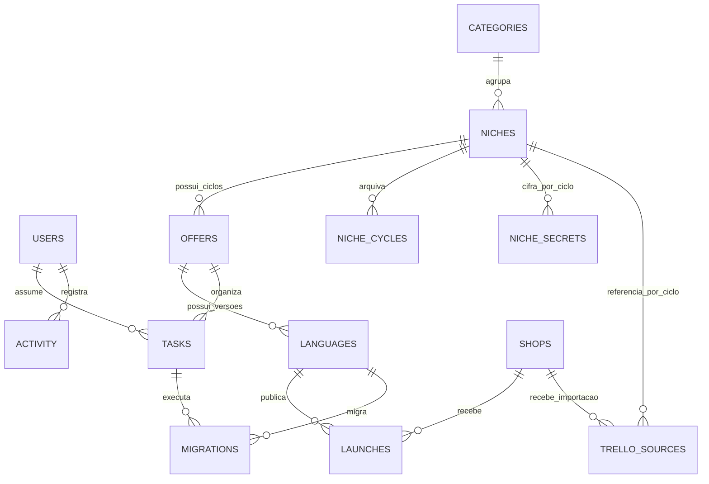

# Arquitetura e evolução do OfferVault

## Fundação existente

A aplicação usa módulos Python e cryptography/Fernet, SQLite em WAL e frontend HTML/CSS/JavaScript. A escolha aproveita a VPS e a publicação GitHub existentes sem exigir um novo serviço ou conta. SQLite oferece transações, chaves estrangeiras e índices para a equipe atual. PostgreSQL continua sendo a opção de evolução para um cenário com vários processos e escala maior; essa migração ainda não foi executada.

O transporte é JSON sob `/operacao/api/`. O servidor verifica sessão em toda leitura privada e escrita. POSTs exigem Origin exata e formato JSON. URLs aceitam somente HTTP(S). Dados inseridos pela equipe são escapados na interface. Credenciais de infraestrutura ficam nos GitHub Secrets existentes.

## Modelo relacional até a versão 2

`offers` representa nesta entrega a base operacional de um ciclo do nicho. Não é ainda a entidade comercial completa com múltiplas coleções e preços. O cadastro de livros e bônus foi retirado da interface a pedido do usuário. Tabelas de experimentos anteriores permanecem compatíveis no esquema, sem exigir seu uso. Os quatro links de pastas do nicho ficam na base inglesa e reiniciam com o ciclo.

Cada nicho começa com um ciclo e um idioma inglês. A base recebe sete tarefas na sequência informada: oferta, nomes, capas, imagens do site, copy, página e books. Cada tradução recebe duas tarefas: tradução integral e revisão. Cada lançamento recebe produto Shopify, página Shopify, checkout/entrega e campanha.

Um idioma é único por base e código. Um lançamento é único por idioma e loja. Desmarcar uma Shopify oculta suas tarefas e preserva os dados para uma eventual reativação. Isso permite a mesma tradução em lojas simultâneas, mantendo IDs de produto e variante, URLs e publicação separados.

O Gamma tem somente um campo de texto livre por nicho/ciclo em `niche_secrets`. Esse conteúdo é criptografado com Fernet e consultado separadamente mediante sessão. O estado geral traz apenas existência, versão e data de atualização. Exportações e atividades não incluem esse texto. A chave persistente fica fora do diretório público, com backup privado.

## Ciclos, concorrência e auditoria

O reinício executa uma transação: fotografa os registros do ciclo atual, incrementa o ciclo do nicho e cria uma base inglesa pendente sem idiomas traduzidos, links, acesso Gamma, lojas ou migrações. Outros nichos permanecem iguais. Os registros anteriores continuam no banco e o snapshot pode ser consultado/exportado. Escritas desatualizadas em ciclos anteriores são recusadas.

Registros editáveis têm `version`. A escrita de uma versão antiga retorna 409, evitando sobrescrever silenciosamente trabalho de outra pessoa. UUIDs de comando impedem cadastros duplicados em tentativas repetidas. A interface consulta a revisão compartilhada a cada dez segundos e ao retomar a janela. Não é edição offline; uma falha ao salvar preserva os campos e informa que é preciso tentar novamente.

A situação do idioma é manual. A regra de migração usa somente `operational_status == active`. Desativado e em preparação não migram. O plano registra origem, destino, responsável e tarefa; a tradução não é recriada. O checklist do destino começa sem copiar IDs/URLs da loja de origem.

`schema_migrations` registra a versão aplicada. A versão 1 é a fundação inicial. A versão 2 acrescenta somente `trello_sources`, preservando os registros existentes. A atualização é testada contra um banco da versão 1, e o instalador salva um backup consistente antes do deploy. Novas versões deverão ser migrações explícitas e testadas, sem reconstruir o banco de produção.

## Importação revisada do Trello

Somente o responsável executa `import_trello`. O backend valida nomes, códigos de idioma, identificadores e links HTTPS de cartões Trello antes da escrita. Cada comando importa um nicho atomicamente, associa seus cartões e registra a origem no histórico. Um digest do payload com Shopify e interpretação do checklist torna a repetição idempotente. Dados diferentes de um cartão já importado recebem 409 para não substituir edições da equipe.

O importador mantém a base inglesa, reaproveita idiomas existentes e não sobrescreve situações, Facebook ou lojas já ajustadas pela equipe. Novos idiomas concluídos recebem a Shopify, a tarefa de tradução concluída e as tarefas de produto/página concluídas. A revisão e o checkout permanecem pendentes por falta de evidência. Facebook só é marcado quando a interpretação escolhida confirma sua operação; resultado positivo requer a opção explícita correspondente. Nichos novos com Facebook confirmado e resultado desconhecido começam **Em teste**, enquanto a situação de cada idioma continua **Em preparação**. As fontes são limitadas ao ciclo atual e integram o snapshot do ciclo anterior ao reiniciar.

O arquivo é um snapshot revisado obtido do Trello, não uma conexão automática do app com a API. Nenhuma chave Trello chega ao frontend. Não há atualizações periódicas nem alterações nos cartões originais.

## Próximas fases

Estas funcionalidades ainda não foram implementadas:

| Fase | Evolução | Decisões preservadas |
|---|---|---|
| 2 — Organização adicional | Templates de tarefas, comentários e alertas de pendências, caso a equipe precise | Arquivos por links do Drive; produção original em inglês; manter campos simples |
| 3 — Internacionalização comercial | Mercados separados de idiomas; países, moedas, preços por oferta localizada, descontos calculados e páginas versionadas | Não tratar idioma como país; não copiar IDs Shopify entre lojas |
| 4 — Marketing e resultados | Campanhas/contas de anúncios, testes de 48h, CSV, métricas e decisões manuais | Adiada a pedido do usuário; regra inicial informada: vendas e ROAS estritamente acima de 2,3; não exigir métricas agora |
| 5 — Operação avançada | Templates de suporte, biblioteca versionada de copy/prompts, alertas, relatórios e integrações | Não enviar mensagens nem links automaticamente; indicar origem de dados; nunca misturar moedas sem conversão |

A futura migração PostgreSQL deverá manter identificadores, relacionamentos e histórico e substituir somente a camada de persistência/serviço necessária. Não está configurada nenhuma integração com Meta Ads, Shopify ou Drive. Os links são referências que a equipe abre nas ferramentas originais.

## Limites desta entrega

O app salva a organização e o histórico, não o conteúdo das pastas do Drive. As permissões dos arquivos devem ser concedidas no Drive. Não existe upload nem obtenção automática de performance. O Gamma é guardado criptografado e pode ser consultado pela equipe autenticada. A pesquisa encontra os registros/URLs cadastrados, não o conteúdo dos arquivos externos. Backups são locais à VPS; cópia externa e monitoramento de restauração são evoluções de infraestrutura.
